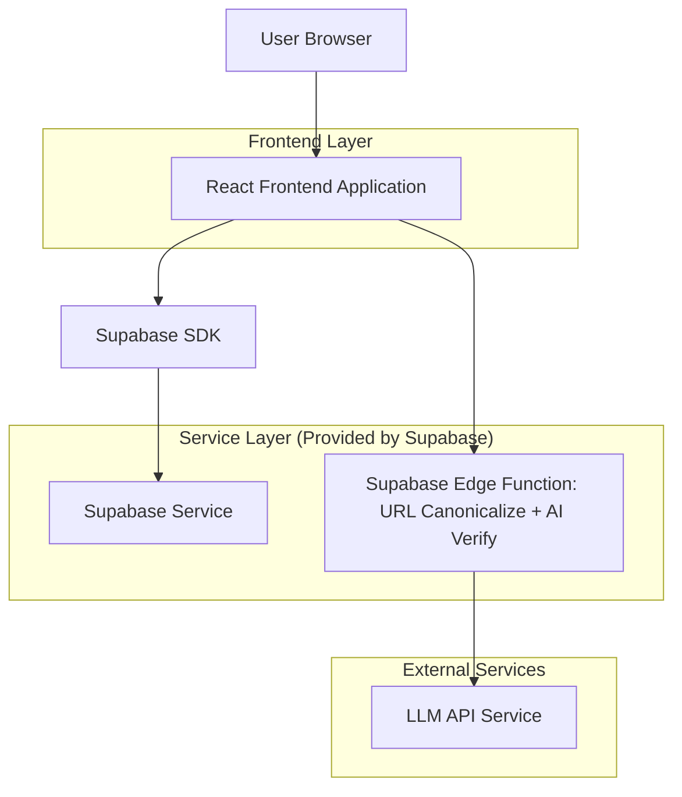
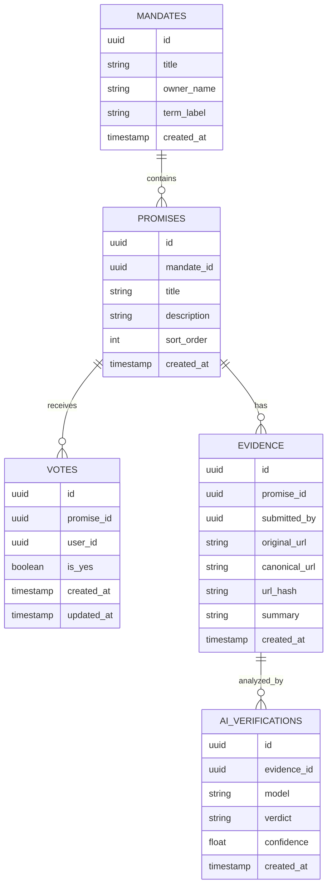

## 1.Architecture design


## 2.Technology Description
- Frontend: React@18 + TypeScript + vite + tailwindcss@3
- Backend: Supabase (Auth + Postgres + Edge Functions)

## 3.Route definitions
| Route | Purpose |
|---|---|
| / | Home (browse/search mandates) |
| /mandates/:mandateId | Mandate scorecard (promises, votes, evidence, audit) |
| /auth | Sign in (magic link / OTP) |

## 6.Data model(if applicable)

### 6.1 Data model definition


### 6.2 Data Definition Language
```sql
-- mandates
create table mandates (
  id uuid primary key default gen_random_uuid(),
  title text not null,
  owner_name text not null,
  term_label text,
  created_at timestamptz not null default now()
);

-- promises
create table promises (
  id uuid primary key default gen_random_uuid(),
  mandate_id uuid not null,
  title text not null,
  description text,
  sort_order int not null default 0,
  created_at timestamptz not null default now()
);
create index idx_promises_mandate_id on promises(mandate_id);

-- votes (anti-duplicate voting)
create table votes (
  id uuid primary key default gen_random_uuid(),
  promise_id uuid not null,
  user_id uuid not null,
  is_yes boolean not null,
  created_at timestamptz not null default now(),
  updated_at timestamptz not null default now()
);
create unique index uq_votes_promise_user on votes(promise_id, user_id);

-- evidence (anti-duplicate links)
create table evidence (
  id uuid primary key default gen_random_uuid(),
  promise_id uuid not null,
  submitted_by uuid not null,
  original_url text not null,
  canonical_url text not null,
  url_hash text not null,
  summary text,
  created_at timestamptz not null default now()
);
create unique index uq_evidence_promise_urlhash on evidence(promise_id, url_hash);

-- minimal grants pattern (repeat for other tables)
grant select on mandates to anon;
grant all privileges on mandates to authenticated;
```

**RLS (recommended)**
- Public read: allow `SELECT` to anon on mandates/promises/evidence/aggregated views.
- Auth write: allow authenticated to `INSERT/UPDATE` own votes (`user_id = auth.uid()`), and `INSERT` own evidence.
- Maintainer actions: implement allowlist via a `profiles.role` claim and RLS checks.

**Edge Function responsibilities**
- Canonical URL sanitization: normalize scheme/host, remove fragments, strip tracking params (e.g., utm_*), sort query params, and optionally follow redirects to final URL; store `canonical_url` and `url_hash` (sha256 of canonical_url).
- AI verification (secondary): fetch evidence metadata/text (when allowed), call LLM, store verdict/confidence + explanation; UI labels output as advisory only.

**Audit trail (implementation note)**
- Use an append-only `audit_events` table written by database triggers and/or edge functions so every vote change, evidence mutation, and duplicate resolution is recorded with actor + timestamp.