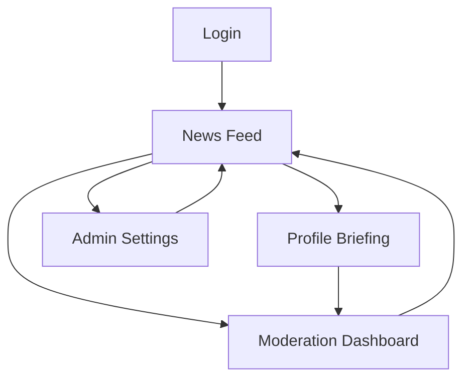

## 1. Product Overview
An AI-powered news aggregation system for officials/profiles that continuously ingests credible sources, deduplicates and matches entities, and surfaces a clean, moderated briefing feed.
It refreshes every 15 minutes while enforcing privacy compliance and auditability.

## 2. Core Features

### 2.1 User Roles
| Role | Registration Method | Core Permissions |
|------|---------------------|------------------|
| Analyst (Viewer) | Admin creates account / SSO invite | Browse feed, search, view profile briefings, export/share links internally |
| Moderator | Admin assigns role | Review AI matches, approve/reject items, edit entity links, handle takedowns |
| Admin | Initial admin via Supabase Auth + DB seed | Manage sources, entity registry, retention/privacy settings, user roles, view audit logs |

### 2.2 Feature Module
Our requirements consist of the following main pages:
1. **Login**: authenticate, session management.
2. **News Feed**: latest aggregated items, search/filter, item detail preview.
3. **Profile Briefing**: profile overview, matched coverage timeline, related entities.
4. **Moderation Dashboard**: review queue, dedupe/entity-match corrections, approvals.
5. **Admin Settings**: source management, profiles registry, privacy & retention controls, user management.

### 2.3 Page Details
| Page Name | Module Name | Feature description |
|-----------|-------------|---------------------|
| Login | Authentication | Sign in/out using managed auth; enforce MFA if enabled; handle password reset/invite flow |
| News Feed | Refresh + listing | Show most recent items (15-minute refresh); paginate; highlight “new since last visit” |
| News Feed | Search & filters | Search by keyword; filter by source credibility tier, date range, language, profile/entity, status (approved/pending) |
| News Feed | Item detail | Open item to view summary, original link, extracted entities, duplicates cluster, moderation state |
| Profile Briefing | Profile header | Display official/profile metadata (name, aliases, role/organization), last updated, watch status |
| Profile Briefing | Coverage timeline | List matched articles for the profile; group duplicates; allow sorting and filtering |
| Profile Briefing | Entity graph (lightweight) | Show top co-mentioned entities and topics; allow click-through to filtered feed |
| Moderation Dashboard | Review queue | List pending/flagged items; batch approve/reject; require reason for takedown |
| Moderation Dashboard | Entity match correction | Edit matched profile/entity; merge/split duplicate clusters; record changes in audit log |
| Moderation Dashboard | Policy controls | Mark sources/items as blocked; apply redaction tags when required |
| Admin Settings | Sources | Add/edit/disable sources; set ingest method (RSS/API), polling rules, credibility tier |
| Admin Settings | Profiles registry | Create/edit profiles with aliases; define matching rules (keywords, org, location hints) |
| Admin Settings | Privacy & retention | Configure retention window, deletion requests workflow, access logging, export controls |
| Admin Settings | Users & roles | Invite users, assign roles, deactivate accounts; view role change history |

## 3. Core Process
**Analyst Flow**: You sign in → open the News Feed → filter by a profile or topic → open an item to read the AI summary and source link → optionally flag an item for review.

**Moderator Flow**: You sign in → open Moderation Dashboard → review pending items and duplicate clusters → correct entity matches if needed → approve/reject → changes appear in the Feed/Profile Briefing with an audit trail.

**Admin Flow**: You sign in → manage sources and profiles/aliases → configure privacy/retention rules → invite users and assign roles → monitor audit logs.

