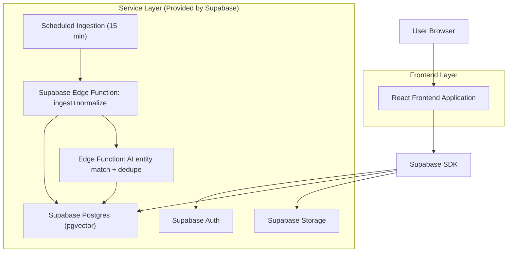
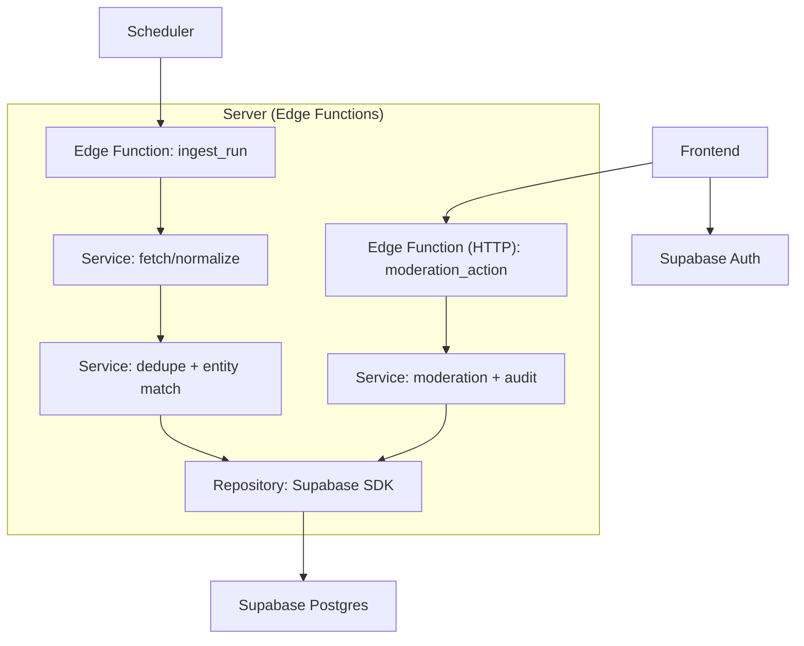
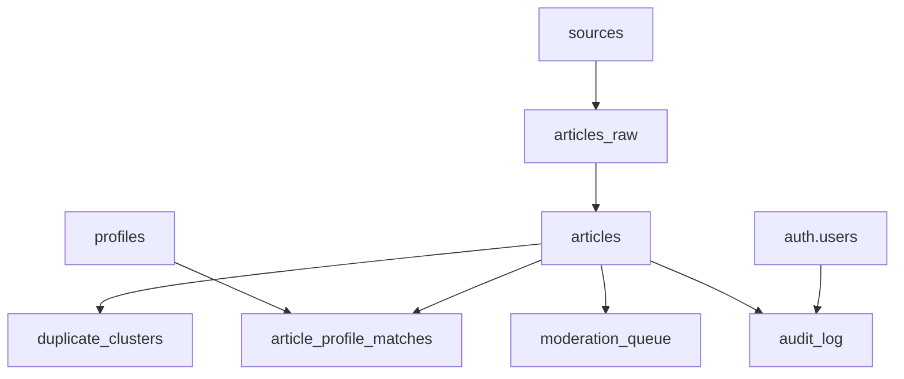

## 1.Architecture design


## 2.Technology Description
- Frontend: React@18 + TypeScript + vite + tailwindcss@3
- Backend: Supabase (Auth + Postgres + Edge Functions + Scheduled triggers)

## 3.Route definitions
| Route | Purpose |
|-------|---------|
| /login | Authenticate and establish session |
| /feed | Primary news feed with filters and item details |
| /profiles/:id | Profile briefing with matched coverage |
| /moderation | Moderation queue and entity/dedupe correction |
| /admin | Sources, profiles registry, privacy/retention, users/roles |

## 4.API definitions (If it includes backend services)
### 4.1 Edge Functions (server-side)
- Scheduled (every 15 minutes): `ingest_run()`
- HTTPS (moderation actions): `POST /functions/v1/moderation_action`

Shared TypeScript types (used by frontend + functions):
```ts
type Source = {
  id: string;
  name: string;
  base_url: string;
  ingest_type: "rss" | "api";
  credibility_tier: "tier1" | "tier2" | "blocked";
  is_active: boolean;
};

type Profile = {
  id: string;
  display_name: string;
  aliases: string[];
  organization?: string;
  country?: string;
  is_active: boolean;
};

type Article = {
  id: string;
  source_id: string;
  title: string;
  url: string;
  published_at: string;
  content_hash: string; // for dedupe
  summary: string; // AI-generated
  moderation_status: "pending" | "approved" | "rejected";
};

type ArticleEntityMatch = {
  article_id: string;
  profile_id: string;
  confidence: number; // 0..1
  rationale?: string;
};
```

Request (moderation action):
| Param Name | Param Type | isRequired | Description |
|-----------|------------|-----------|-------------|
| articleId | string | true | Target article |
| action | "approve" \| "reject" \| "relink" \| "merge_duplicates" | true | Moderation operation |
| payload | object | false | Operation-specific fields (e.g., newProfileId, mergeIntoId) |
| reason | string | true | Stored for auditability |

Response:
| Param Name | Param Type | Description |
|-----------|------------|-------------|
| ok | boolean | Whether action succeeded |

## 5.Server architecture diagram (If it includes backend services)


## 6.Data model(if applicable)
### 6.1 Data model definition


### 6.2 Data Definition Language
Core tables (logical relations; enforce via application + RLS policies):
```sql
CREATE TABLE sources (
  id uuid PRIMARY KEY DEFAULT gen_random_uuid(),
  name text NOT NULL,
  base_url text NOT NULL,
  ingest_type text NOT NULL CHECK (ingest_type IN ('rss','api')),
  credibility_tier text NOT NULL DEFAULT 'tier1' CHECK (credibility_tier IN ('tier1','tier2','blocked')),
  is_active boolean NOT NULL DEFAULT true,
  created_at timestamptz NOT NULL DEFAULT now()
);

CREATE TABLE profiles (
  id uuid PRIMARY KEY DEFAULT gen_random_uuid(),
  display_name text NOT NULL,
  aliases jsonb NOT NULL DEFAULT '[]'::jsonb,
  organization text,
  country text,
  is_active boolean NOT NULL DEFAULT true,
  created_at timestamptz NOT NULL DEFAULT now()
);

CREATE TABLE articles (
  id uuid PRIMARY KEY DEFAULT gen_random_uuid(),
  source_id uuid NOT NULL,
  title text NOT NULL,
  url text UNIQUE NOT NULL,
  published_at timestamptz,
  content_hash text NOT NULL,
  summary text,
  moderation_status text NOT NULL DEFAULT 'pending' CHECK (moderation_status IN ('pending','approved','rejected')),
  embedding vector(1536),
  created_at timestamptz NOT NULL DEFAULT now()
);

CREATE TABLE article_profile_matches (
  article_id uuid NOT NULL,
  profile_id uuid NOT NULL,
  confidence numeric NOT NULL,
  rationale text,
  decided_by uuid,
  decided_at timestamptz,
  PRIMARY KEY(article_id, profile_id)
);

CREATE TABLE audit_log (
  id uuid PRIMARY KEY DEFAULT gen_random_uuid(),
  actor_user_id uuid,
  action text NOT NULL,
  target_type text NOT NULL,
  target_id uuid,
  reason text,
  meta jsonb NOT NULL DEFAULT '{}'::jsonb,
  created_at timestamptz NOT NULL DEFAULT now()
);

-- Permissions baseline (prefer RLS for privacy; keep anon minimal)
GRANT SELECT ON sources TO anon;
GRANT ALL PRIVILEGES ON sources TO authenticated;
GRANT ALL PRIVILEGES ON profiles, articles, article_profile_matches, audit_log TO authenticated;
```

Privacy & compliance notes (implemented via config + RLS + logging):
- Require authentication for access to articles/profiles; restrict admin/moderator routes by role claims.
- Log moderation/admin actions to `audit_log`; retain per configured retention window.
- Minimize stored PII; store only what is required for profile matching and briefing context.
- Support deletion requests by removing profile records and reprocessing matches where applicable.