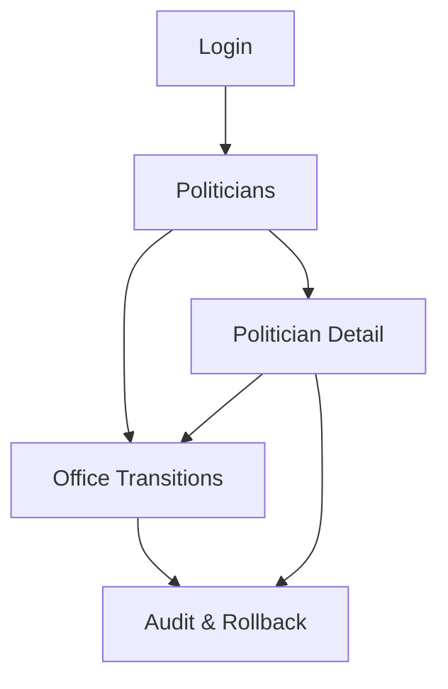

## 1. Product Overview
A secure admin console to manage politicians, their office status, and transitions over time.
It supports automated single/bulk transitions, full audit history, and safe rollback.

## 2. Core Features

### 2.1 User Roles
| Role | Registration Method | Core Permissions |
|------|---------------------|------------------|
| Admin | Supabase Auth (email/password or SSO) | Manage politicians, run transitions (single/bulk), rollback, manage access |
| Auditor (Read-only) | Admin invites user / assigns role | View politicians, transitions, and audit history only |

### 2.2 Feature Module
Our politician management requirements consist of the following main pages:
1. **Login**: authenticate, sign out.
2. **Politicians**: non-office list, search/filter, politician detail.
3. **Office Transitions**: single transition, bulk transition, automated scheduling preview.
4. **Audit & Rollback**: audit timeline, transition batch details, rollback execution.

### 2.3 Page Details
| Page Name | Module Name | Feature description |
|-----------|-------------|---------------------|
| Login | Authentication | Sign in via Supabase Auth; sign out; show access denied when role insufficient. |
| Politicians | Non-office list | List politicians where current_office_status = "non-office"; filter by name, party, state, last office; paginate and export CSV. |
| Politicians | Politician detail | View identity fields and current/previous office terms; show recent transitions and audit entries for this politician. |
| Politicians | Create/Edit politician (Admin only) | Create and edit politician profile; set identifiers; validate uniqueness; soft-delete / deactivate record. |
| Office Transitions | Single transition (Admin only) | Move one politician between statuses (e.g., non-office -> in-office, in-office -> non-office); require effective date/time, office (optional), and reason; preview changes before apply. |
| Office Transitions | Bulk transition (Admin only) | Upload/select multiple politicians; apply a shared transition (status/office/effective date/reason); run validation; show per-row errors; commit as one batch id. |
| Office Transitions | Automated transition rules (Admin only) | Define rules based on term end/start dates to automatically change status; provide dry-run preview and next-run summary. |
| Audit & Rollback | Audit history | Immutable log of who changed what and when, including before/after snapshots; filter by actor, politician, batch id, date range; export. |
| Audit & Rollback | Rollback (Admin only) | Roll back a single transition or entire batch; enforce constraints (cannot rollback if later dependent transitions exist unless rolling back them too); record rollback as new audit events. |
| Audit & Rollback | API access (Admin only) | View API usage keys/tokens (if enabled), rotate/revoke keys; view API request logs (minimal). |

## 3. Core Process
**Admin Flow**
1. Sign in.
2. Open Politicians page and review the non-office list.
3. For one-off updates, open a politician and run a Single transition with an effective date and reason.
4. For many updates, use Bulk transition, validate, then commit as a batch.
5. Review audit history for the batch; if errors are found, roll back the batch.
6. Configure automated transition rules so future term boundaries update statuses automatically; review dry-run before enabling.

**Auditor Flow**
1. Sign in.
2. Browse Politicians and Office Transitions (read-only views).
3. Use Audit & Rollback page to inspect changes and download audit exports (no rollback access).

