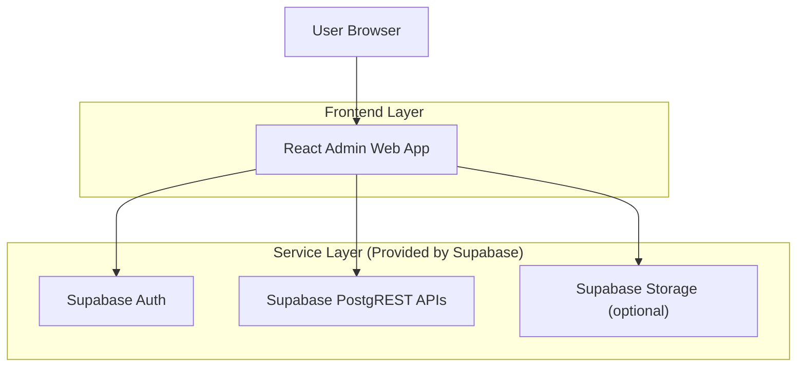
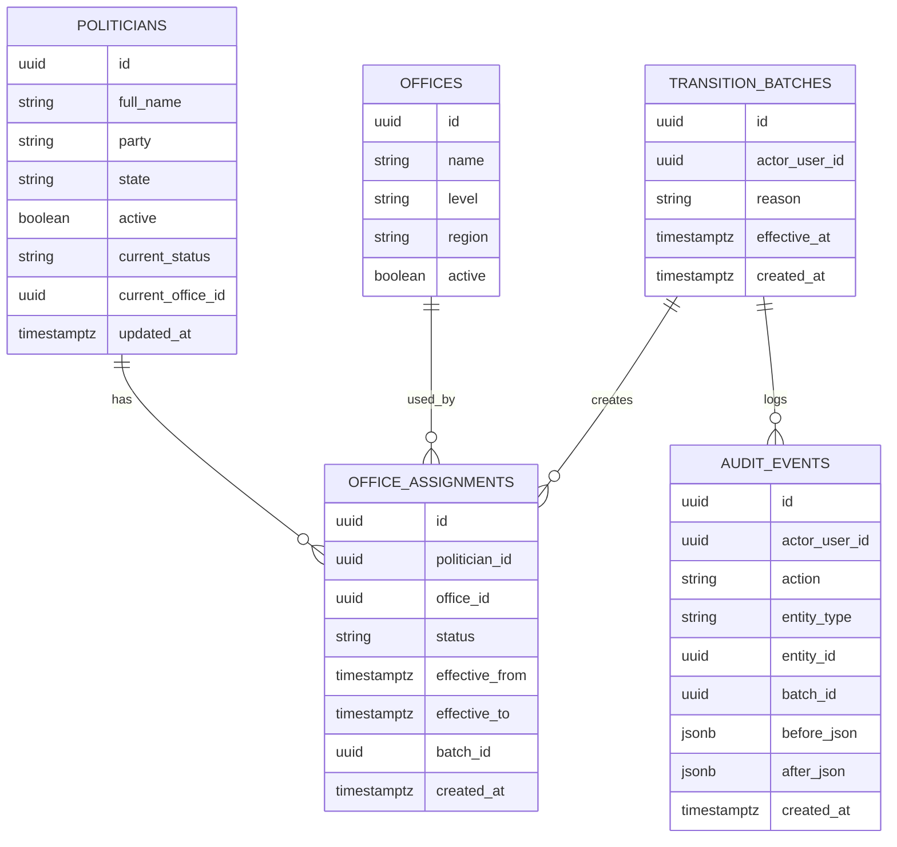

## 1.Architecture design


## 2.Technology Description
- Frontend: React@18 + TypeScript + vite + tailwindcss@3
- Backend: Supabase (Auth + PostgreSQL + PostgREST + RPC)
- Testing: Vitest + React Testing Library (UI/unit), Playwright (E2E), Supabase local stack for integration tests

## 3.Route definitions
| Route | Purpose |
|-------|---------|
| /login | Authenticate user via Supabase Auth |
| /politicians | Non-office politicians list + search/filter |
| /politicians/:id | Politician detail + history |
| /transitions | Single + bulk transitions + automated rules |
| /audit | Audit history + rollback actions |

## 4.API definitions (If it includes backend services)
No custom backend service is required. The system exposes APIs via Supabase PostgREST and RPC (Postgres functions) with role-based access enforced by RLS and function security.

### 4.1 Core Types (shared)
```ts
export type UUID = string;

export type OfficeStatus = "non-office" | "in-office" | "unknown";

export type Politician = {
  id: UUID;
  full_name: string;
  party?: string | null;
  state?: string | null;
  active: boolean;
  current_status: OfficeStatus;
  current_office_id?: UUID | null;
  updated_at: string;
};

export type TransitionRequest = {
  politician_ids: UUID[];      // 1 for single
  to_status: OfficeStatus;
  to_office_id?: UUID | null;
  effective_at: string;        // ISO datetime
  reason: string;
};

export type TransitionResult = {
  batch_id: UUID;
  applied_count: number;
  rejected: Array<{ politician_id: UUID; error: string }>;
};

export type AuditEvent = {
  id: UUID;
  actor_user_id: UUID;
  action: "TRANSITION" | "ROLLBACK" | "CREATE" | "UPDATE" | "DEACTIVATE";
  entity_type: "POLITICIAN" | "ASSIGNMENT" | "RULE";
  entity_id: UUID;
  batch_id?: UUID | null;
  before_json?: unknown;
  after_json?: unknown;
  created_at: string;
};
```

### 4.2 RPC Functions (recommended)
These are invoked from the frontend using the Supabase client (RPC):
- `rpc_apply_transition(request TransitionRequest) -> TransitionResult`
- `rpc_rollback_batch(batch_id uuid) -> TransitionResult`
- `rpc_preview_automations(run_at timestamptz) -> json`

## 6.Data model(if applicable)

### 6.1 Data model definition


### 6.2 Data Definition Language
Politicians (politicians)
```sql
CREATE TABLE politicians (
  id UUID PRIMARY KEY DEFAULT gen_random_uuid(),
  full_name TEXT NOT NULL,
  party TEXT NULL,
  state TEXT NULL,
  active BOOLEAN NOT NULL DEFAULT TRUE,
  current_status TEXT NOT NULL DEFAULT 'non-office',
  current_office_id UUID NULL,
  updated_at TIMESTAMPTZ NOT NULL DEFAULT now()
);
CREATE INDEX idx_politicians_status ON politicians(current_status);
CREATE INDEX idx_politicians_name ON politicians(full_name);

CREATE TABLE offices (
  id UUID PRIMARY KEY DEFAULT gen_random_uuid(),
  name TEXT NOT NULL,
  level TEXT NULL,
  region TEXT NULL,
  active BOOLEAN NOT NULL DEFAULT TRUE
);

CREATE TABLE transition_batches (
  id UUID PRIMARY KEY DEFAULT gen_random_uuid(),
  actor_user_id UUID NOT NULL,
  reason TEXT NOT NULL,
  effective_at TIMESTAMPTZ NOT NULL,
  created_at TIMESTAMPTZ NOT NULL DEFAULT now()
);
CREATE INDEX idx_transition_batches_created_at ON transition_batches(created_at DESC);

CREATE TABLE office_assignments (
  id UUID PRIMARY KEY DEFAULT gen_random_uuid(),
  politician_id UUID NOT NULL,
  office_id UUID NULL,
  status TEXT NOT NULL,
  effective_from TIMESTAMPTZ NOT NULL,
  effective_to TIMESTAMPTZ NULL,
  batch_id UUID NULL,
  created_at TIMESTAMPTZ NOT NULL DEFAULT now()
);
CREATE INDEX idx_assignments_politician ON office_assignments(politician_id, effective_from DESC);
CREATE INDEX idx_assignments_batch ON office_assignments(batch_id);

CREATE TABLE audit_events (
  id UUID PRIMARY KEY DEFAULT gen_random_uuid(),
  actor_user_id UUID NOT NULL,
  action TEXT NOT NULL,
  entity_type TEXT NOT NULL,
  entity_id UUID NOT NULL,
  batch_id UUID NULL,
  before_json JSONB NULL,
  after_json JSONB NULL,
  created_at TIMESTAMPTZ NOT NULL DEFAULT now()
);
CREATE INDEX idx_audit_entity ON audit_events(entity_type, entity_id, created_at DESC);
CREATE INDEX idx_audit_batch ON audit_events(batch_id, created_at DESC);

-- RLS (high level):
-- - Auditor: SELECT on politicians/offices/assignments/batches/audit
-- - Admin: ALL on the above
ALTER TABLE politicians ENABLE ROW LEVEL SECURITY;
ALTER TABLE offices ENABLE ROW LEVEL SECURITY;
ALTER TABLE transition_batches ENABLE ROW LEVEL SECURITY;
ALTER TABLE office_assignments ENABLE ROW LEVEL SECURITY;
ALTER TABLE audit_events ENABLE ROW LEVEL SECURITY;

-- Grants (baseline guidance)
GRANT SELECT ON politicians, offices, transition_batches, office_assignments, audit_events TO anon;
GRANT ALL PRIVILEGES ON politicians, offices, transition_batches, office_assignments, audit_events TO authenticated;
```

## Testing strategy (required)
- Unit tests: validate transition form rules, bulk parsing/validation, and role-based UI gating.
- Integration tests: call `rpc_apply_transition` and assert correct inserts into `office_assignments` + `audit_events`, and correct rollback behavior.
- E2E tests: login, run a bulk transition, verify audit timeline, perform rollback, confirm state restored.

## Rollback approach (required)
- Every transition produces a `transition_batches` row and writes immutable `audit_events` with before/after snapshots.
- Rollback executes as a new action (never deletes audit): it restores the previous effective assignment state and updates `politicians.current_status/current_office_id` accordingly, then records `ROLLBACK` audit events.
- Safety rule: rollback is blocked if later transitions exist for affected politicians unless those transitions are included in the rollback batch.